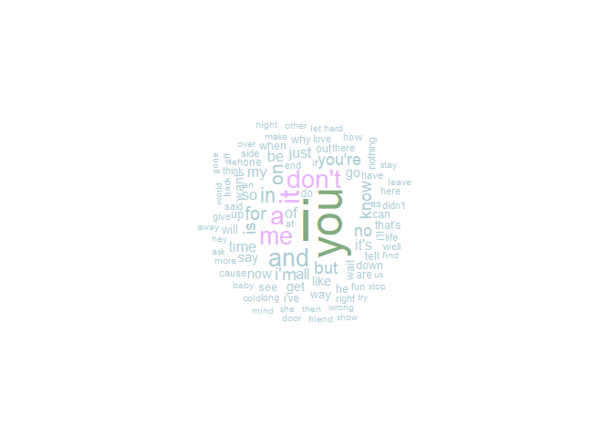

# abnoRmal

##### an analysis of The Strokes’ discography using the `spotifyr` package and my Spotify listening history


------------------------------------------------------------------------

``` r
# setting up my Spotify client ID & client secret
Sys.setenv(SPOTIFY_CLIENT_ID = "client ID here")
Sys.setenv(SPOTIFY_CLIENT_SECRET = "client secret here")
access_token = get_spotify_access_token()
```

``` r
# using spotifyr to get data on The Strokes
strokes = get_artist_audio_features("the strokes")

# confirming we have the correct albums
strokes |>
  count(album_name)
```

    ##                   album_name  n
    ## 1                     Angles 10
    ## 2           Comedown Machine 11
    ## 3 First Impressions Of Earth 28
    ## 4                 Is This It 33
    ## 5               Room On Fire 11
    ## 6           The New Abnormal  9

There are too many tracks for *Is This It* and *First Impressions Of
Earth* - let’s inspect that (although I wish they had 33 and 28 tracks)

``` r
strokes |>
  filter(album_name == "First Impressions Of Earth") |>
  count(track_name) |>
  head(5)
```

    ##         track_name n
    ## 1       15 Minutes 2
    ## 2  Ask Me Anything 2
    ## 3 Electricityscape 2
    ## 4      Evening Sun 2
    ## 5    Fear of Sleep 2

looks like everything is double counted, there seems to just be one
duplicate - let’s inspect what’s different by looking at the multiple
entries for the album’s first track, *You Only Live Once*

``` r
strokes |>
  filter(track_name == "You Only Live Once") |>
  select(artist_name, album_release_date, track_name, album_name)
```

    ##   artist_name album_release_date         track_name                 album_name
    ## 1 The Strokes         2006-01-03 You Only Live Once First Impressions Of Earth
    ## 2 The Strokes         2006-01-03 You Only Live Once First Impressions Of Earth

we have different values for the following variables:

- `danceability` (0.631 v. 0.630)
- `energy` (0.905 v. 0.908)
- `loudness` (-2.44 v. -2.42)
- `speechiness` (0.0325 v. 0.0326)
- `acousticness` (0.0328 v. 0.0238)
- `instrumentalness` (0.528 v. 0.592)
- `liveness` (0.125 v. 0.116)
- `valence` (0.969 v. 0.968)
- `tempo` (120.520 v. 120.522)

so how do we decide which one we keep and which we omit?

looking at [this
forum](https://community.spotify.com/t5/iOS-iPhone-iPad/Duplicates-of-the-same-albums/td-p/4542505),
it looks like i would probably want to default to the most recent
release. however, as you can see below, the different versions of the
album in the data have the same release date.

``` r
strokes |>
  filter(album_name == "First Impressions Of Earth") |>
  count(album_release_date)
```

    ##   album_release_date  n
    ## 1         2006-01-03 28

upon further inspection, i found my answer in the `album_images` column.
i’ll put the images side-by-side below and we can pretty easily see
which one is the right album cover.


so now i’ll make sure to omit all instances of the first version of the
album using the `album_id` variable, which is unique for each of the two
versions.

``` r
strokes = strokes |>
  filter(album_id != "1HQ61my1h3VWp2EBWKlp0n")
```

and now we need to address the same issue for The Strokes’ first album,
*Is This It*.

``` r
strokes |>
  filter(album_name == "Is This It") |>
  count(track_name) |>
  head(5)
```

    ##        track_name n
    ## 1 Alone, Together 3
    ## 2    Barely Legal 3
    ## 3 Hard To Explain 3
    ## 4      Is This It 3
    ## 5       Last Nite 3

here we have three different versions of the album. again, taking a look
at the album images, i can tell which one is the version currently on
spotify, so i will choose that one to keep.

``` r
strokes = strokes |>
  filter(album_id != "1BbxngE1wn7Lzantkvket2" & album_id != "2yNaksHgeMQM9Quse463b5")

strokes |>
  count(album_name)
```

    ##                   album_name  n
    ## 1                     Angles 10
    ## 2           Comedown Machine 11
    ## 3 First Impressions Of Earth 14
    ## 4                 Is This It 11
    ## 5               Room On Fire 11
    ## 6           The New Abnormal  9

now the data is free of duplicates and we can resume with our analysis.

``` r
strokes |>
  select(artist_name, album_name, track_name) |>
  head(9)
```

    ##   artist_name       album_name                    track_name
    ## 1 The Strokes The New Abnormal        The Adults Are Talking
    ## 2 The Strokes The New Abnormal                      Selfless
    ## 3 The Strokes The New Abnormal     Brooklyn Bridge To Chorus
    ## 4 The Strokes The New Abnormal                 Bad Decisions
    ## 5 The Strokes The New Abnormal                Eternal Summer
    ## 6 The Strokes The New Abnormal                   At The Door
    ## 7 The Strokes The New Abnormal Why Are Sundays So Depressing
    ## 8 The Strokes The New Abnormal          Not The Same Anymore
    ## 9 The Strokes The New Abnormal               Ode To The Mets

``` r
# genius_get_artists <- function(artist_name = "the strokes", n_results = 10) {
#   baseURL <- 'https://api.genius.com/search?q='
#   requestURL <- paste0(baseURL, gsub(' ', '%20', artist_name),
#                        '&per_page=', n_results,
#                        '&access_token=', access_token)
#   
#   res <- GET(requestURL) %>% content %>% .$response %>% .$hits
#   
#   map_df(1:length(res), function(x) {
#     tmp <- res[[x]]$result$primary_artist
#     list(
#       artist_id = tmp$id,
#       artist_name = tmp$name
#     )
#   }) %>% unique
# }
# 
# genius_artists = genius_get_artists("the strokes")
```

``` r
# names(strokes)[9:19]
album_levels = c("Is This It", "Room On Fire", "First Impressions Of Earth",
                 "Angles", "Comedown Machine", "The New Abnormal")

strokes$album_name = factor(strokes$album_name, levels = album_levels)

strokes |>
  ggplot(aes(valence, fct_rev(album_name))) +
  geom_density_ridges(aes(fill = album_name), scale = 0.9, col = "transparent", alpha = 0.75) +
  labs(x = "Valence", y = NULL) +
  theme(legend.position = "none",
        axis.text.x = element_blank())
```

<!-- -->

``` r
# library(geniusr)
# genius_token(T)
# client id = u2X4arrcpERbK2qUOuWi4-SNWDNUJ8bMinDq6jbQPFWKFthB-g5mHNOZjer1Hk7z
# client secret = kOLR9vdB1UsVAOT8gttk2EyeMULG71AL4tVuGQlSpvIiy0YNYo8J_NwZerYm-0FATalY4ydA7SRJnTzHS4zfBA
# access token = q2nsw8oL2l8J5Qs6-Y2DbczMuEUBVgyZ5GetLPuDdxbia3kP78xssEwKSt4GXif0
```

``` r
# library(geniusr)
# library(dplyr)
# library(tidytext)

# get lyrics
# get_lyrics_search(artist_name = "Kanye West",
#                   song_title = "Good Morning") %>% 
#   # get lyric bigrams
#   unnest_tokens(bigram, line, token = "ngrams", n = 2) %>%
#   # look for good morning
#   filter(bigram == "good morning") %>% 
#   # count bigram frequency
#   nrow()

# songs_df = data.frame(song = c("Soma", "Is This It"), lyrics = NA)
# for (i in 1:nrow(songs_df)) {
#   df1 = get_lyrics_search(artist_name = "The Strokes", song_title = songs_df$song[1])
#   str = ""
#   for (i in 1:nrow(df1)) { str = paste(str, df1$line[i]) }
#   lyrics = trimws(str)
#   songs_df$lyrics[i] = lyrics
#   songs_df
# }

### THE ABOVE ISN'T WORKING - MIGHT HAVE TO TRY A JOIN INSTEAD ###

# get_lyrics_search(artist_name = "The Strokes",
#                   song_title = "Soma")

# get_artist_songs(artist_id = "The Strokes")
```

``` r
get_song_lyrics = function(song) {
  df = get_lyrics_search(artist_name = "The Strokes",
                         song_title = song)
  str = ""
  for (i in 1:nrow(df)) {
    str = paste(str, df$line[i])
  }
  return(trimws(str))
}
```

``` r
# songs = c("Soma", "Someday")
#
# for (song in songs) {
#   print(get_song_lyrics("The Strokes", song))
# }
```

``` r
# strokes$lyrics = "nothing yet"
```

``` r
# num = 1
# song_name = strokes$track_name[num]
# lyrics = get_lyrics_search("The Strokes", song_name) |>
#   pull(line)
# 
# str = ""
# 
# for (i in 1:length(lyrics)) {
#   str = paste(str, lyrics[i])
# }
# 
# str = trimws(str)
# song_df = data.frame(track_name = song_name, lyrics = str)
# 
# strokes = left_join(strokes, song_df, by = "track_name")
```

``` r
# lyrs = read_csv("all_with_lyrics.csv", col_types = cols())
# strokes = left_join(strokes, lyrs, by = "track_name")
```

``` r
### this works, chunk below will try to do it in a loop ###
# strokes |>
#   arrange(album_release_date) |>
#   select(track_name, lyrics)
# 
# track = "50/50"
# lyr = get_song_lyrics(track)
# index = which(strokes$track_name == track)
# strokes$lyrics[index] = lyr

# strokes[which(is.na(strokes$lyrics)), ] |>
#   select(track_name, lyrics)
```

``` r
# strokes$lyrics[which(strokes$track_name == "50/50")] = "Why's she telling me the story of her life? All the things you wanna kill will give you spite And if you've taken all the prisoners inside As they're doling out their wisdom in the fire I will say! I will say don't judge me! I will say! I will say don't judge me! I wait on a darkened highway! I wait on a darkened highway! I can take as long as without looking by Why's she telling me the story of her life And if you've taken all the prisoners inside As they've thrown all their wisdom in the fire I will say! I will say don't judge me! I will say! I will say don't judge me! I wait on a darkened highway! I wait on a darkened highway! I will say! I will say don't judge me! I will say! I will say don't judge me! I wait on a darkened highway! I wait on a darkened highway!"
# 
# strokes$lyrics[which(strokes$track_name == "12:51")] = "Talk to me now I'm older Your friend told you 'cause I told her Friday nights have been lonely Change your plans and then phone me We could go and get forties Fuck goin' to that party Oh, really, your folks are away now? Alright, let's go, you convinced me 12:51 is the time my voice Found the words I sought Is it this stage I want? The world is shutting out for us Oh, we were tense for sure But we was confident Kiss me now that I'm older I won't try to control you Friday nights have been lonely Take it slow but don't warn me We'd go out and get forties Then we'd go to some party Oh, really, your folks are away now? Alright, I'm coming I'll be right there"
```

``` r
# strokes |>
#   count(lyrics)
```

# WE FINALLY HAVE ALL THE LYRICS

``` r
strokes = read_csv("strokes_all_lyrics.csv", col_types = cols())
```

``` r
strokes |>
  ggplot(aes(duration_ms)) +
  geom_histogram(bins = 10, col = "black", fill = "transparent")
```

<!-- -->

``` r
library(tidytext)
library(wordcloud)
library(wesanderson)
library(dplyr)
library(yarrr)

word_count = strokes |>
  unnest_tokens(word, lyrics) |>
  count(word, sort = T) |>
  mutate(word = reorder(word, n)) |>
  ungroup()

generate_wordcloud = function(part) {
  valid_words = parts_of_speech |>
    filter(str_detect(pos, part)) |>
    pull(word)
  
  fdata = word_count |>
    filter(word %in% valid_words)
  
  wordcloud(words = fdata$word, freq = fdata$n,
            max.words = 100, random.order = F,
            colors = c("#ABCCD4", "#E9B3FF", "#82AC7E"))
}

generate_wordcloud("Noun")
```

<!-- -->

``` r
generate_wordcloud("Adjective")
```

<!-- -->

``` r
generate_wordcloud("Adverb")
```

<!-- -->

``` r
generate_wordcloud("Verb")
```

<!-- -->

``` r
pirateplot(valence + danceability + energy ~ album_release_year, strokes,
           pal = c("#FFF58F", "#C10000", "#000000", "#FF7DEF", "#FF5F5A", "#5AA0FF"),
           xlab = "album", ylab = "sonic score", main = "sonic score = valence + danceability + energy",
           theme = 0, point.o = 0.7, avg.line.o = 1, jitter.val = .05, 
           bty = "n", cex.axis = 0.6, xaxt = "n")

axis(1, cex.axis = 0.6, lwd = 0)
legend("topright", c("1: Is This It", "2: Room on Fire", "3: First Impressions of Earth",
                     "4: Angles", "5: Comedown Machine", "6: The New Abnormal"), bty = "n", cex = 0.6)
```

<!-- -->

``` r
sonic_tracks = function(album) {
  return(strokes |>
           mutate(sonic_score = valence + danceability + energy) |>
           select(album_name, track_name, sonic_score) |>
           arrange(desc(sonic_score)) |>
           filter(album_name == album))
}

all_albums = c("Is This It", "Room On Fire", "First Impressions Of Earth",
               "Angles", "Comedown Machine", "The New Abnormal")

lapply(all_albums, sonic_tracks)
```

    ## [[1]]
    ## # A tibble: 11 × 3
    ##    album_name track_name          sonic_score
    ##    <chr>      <chr>                     <dbl>
    ##  1 Is This It Alone, Together            2.34
    ##  2 Is This It The Modern Age             2.31
    ##  3 Is This It Last Nite                  2.31
    ##  4 Is This It When It Started            2.28
    ##  5 Is This It Is This It                 2.20
    ##  6 Is This It Barely Legal               2.16
    ##  7 Is This It Take It Or Leave It        1.82
    ##  8 Is This It Trying Your Luck           1.81
    ##  9 Is This It Hard To Explain            1.74
    ## 10 Is This It Someday                    1.74
    ## 11 Is This It Soma                       1.69
    ## 
    ## [[2]]
    ## # A tibble: 11 × 3
    ##    album_name   track_name              sonic_score
    ##    <chr>        <chr>                         <dbl>
    ##  1 Room On Fire The Way It Is                  2.29
    ##  2 Room On Fire Automatic Stop                 2.12
    ##  3 Room On Fire You Talk Way Too Much          1.97
    ##  4 Room On Fire Meet Me in the Bathroom        1.96
    ##  5 Room On Fire 12:51                          1.93
    ##  6 Room On Fire Reptilia                       1.91
    ##  7 Room On Fire Under Control                  1.77
    ##  8 Room On Fire What Ever Happened?            1.73
    ##  9 Room On Fire The End Has No End             1.72
    ## 10 Room On Fire I Can't Win                    1.62
    ## 11 Room On Fire Between Love & Hate            1.60
    ## 
    ## [[3]]
    ## # A tibble: 14 × 3
    ##    album_name                 track_name         sonic_score
    ##    <chr>                      <chr>                    <dbl>
    ##  1 First Impressions Of Earth You Only Live Once        2.50
    ##  2 First Impressions Of Earth Killing Lies              2.24
    ##  3 First Impressions Of Earth Juicebox                  2.03
    ##  4 First Impressions Of Earth Red Light                 2.02
    ##  5 First Impressions Of Earth On the Other Side         1.99
    ##  6 First Impressions Of Earth Evening Sun               1.91
    ##  7 First Impressions Of Earth Electricityscape          1.85
    ##  8 First Impressions Of Earth Razorblade                1.81
    ##  9 First Impressions Of Earth Ize of the World          1.6 
    ## 10 First Impressions Of Earth Fear of Sleep             1.59
    ## 11 First Impressions Of Earth Heart In a Cage           1.41
    ## 12 First Impressions Of Earth Vision of Division        1.40
    ## 13 First Impressions Of Earth 15 Minutes                1.29
    ## 14 First Impressions Of Earth Ask Me Anything           1.14
    ## 
    ## [[4]]
    ## # A tibble: 10 × 3
    ##    album_name track_name                      sonic_score
    ##    <chr>      <chr>                                 <dbl>
    ##  1 Angles     Machu Picchu                           2.39
    ##  2 Angles     Taken for a Fool                       2.34
    ##  3 Angles     Gratisfaction                          2.14
    ##  4 Angles     Two Kinds of Happiness                 2.07
    ##  5 Angles     Games                                  1.80
    ##  6 Angles     Life Is Simple in the Moonlight        1.72
    ##  7 Angles     Under Cover of Darkness                1.71
    ##  8 Angles     You're So Right                        1.63
    ##  9 Angles     Metabolism                             1.61
    ## 10 Angles     Call Me Back                           1.22
    ## 
    ## [[5]]
    ## # A tibble: 11 × 3
    ##    album_name       track_name                  sonic_score
    ##    <chr>            <chr>                             <dbl>
    ##  1 Comedown Machine One Way Trigger                    2.42
    ##  2 Comedown Machine Tap Out                            2.11
    ##  3 Comedown Machine 50/50                              2.04
    ##  4 Comedown Machine Partners In Crime                  2.04
    ##  5 Comedown Machine Welcome To Japan                   2.02
    ##  6 Comedown Machine Slow Animals                       1.81
    ##  7 Comedown Machine Happy Ending                       1.71
    ##  8 Comedown Machine Chances                            1.66
    ##  9 Comedown Machine 80's Comedown Machine              1.37
    ## 10 Comedown Machine All The Time                       1.36
    ## 11 Comedown Machine Call It Fate, Call It Karma        1.14
    ## 
    ## [[6]]
    ## # A tibble: 9 × 3
    ##   album_name       track_name                    sonic_score
    ##   <chr>            <chr>                               <dbl>
    ## 1 The New Abnormal The Adults Are Talking               1.99
    ## 2 The New Abnormal Eternal Summer                       1.72
    ## 3 The New Abnormal Bad Decisions                        1.69
    ## 4 The New Abnormal Brooklyn Bridge To Chorus            1.67
    ## 5 The New Abnormal Why Are Sundays So Depressing        1.59
    ## 6 The New Abnormal Selfless                             1.31
    ## 7 The New Abnormal Not The Same Anymore                 1.25
    ## 8 The New Abnormal Ode To The Mets                      1.24
    ## 9 The New Abnormal At The Door                          1.14

``` r
words_by_album = strokes |>
  select(album_name, track_name, lyrics) |>
  unnest_tokens(words, lyrics) |>
  group_by(album_name, track_name) |>
  summarise(n = n())

unique_words_album = strokes |>
  select(album_name, track_name, lyrics) |>
  unnest_tokens(words, lyrics) |>
  group_by(album_name, track_name) |>
  distinct(words) |>
  group_by(album_name, track_name) |>
  summarise(n = n())

words_by_album |>
  left_join(unique_words_album, by = "album_name") |>
  rename(words = n.x, unique_words = n.y, track_name = track_name.x) |>
  mutate(lexical_diversity = round(unique_words / words, 3)) |>
  arrange(desc(lexical_diversity)) |>
  select(album_name, track_name, lexical_diversity)
```

    ## # A tibble: 740 × 3
    ## # Groups:   album_name [6]
    ##    album_name                 track_name   lexical_diversity
    ##    <chr>                      <chr>                    <dbl>
    ##  1 Angles                     Metabolism                1.88
    ##  2 Angles                     Metabolism                1.81
    ##  3 Angles                     Metabolism                1.67
    ##  4 First Impressions Of Earth Killing Lies              1.54
    ##  5 First Impressions Of Earth Killing Lies              1.53
    ##  6 Angles                     Metabolism                1.51
    ##  7 Angles                     Metabolism                1.44
    ##  8 First Impressions Of Earth Killing Lies              1.37
    ##  9 Angles                     Games                     1.34
    ## 10 Angles                     Games                     1.29
    ## # … with 730 more rows
