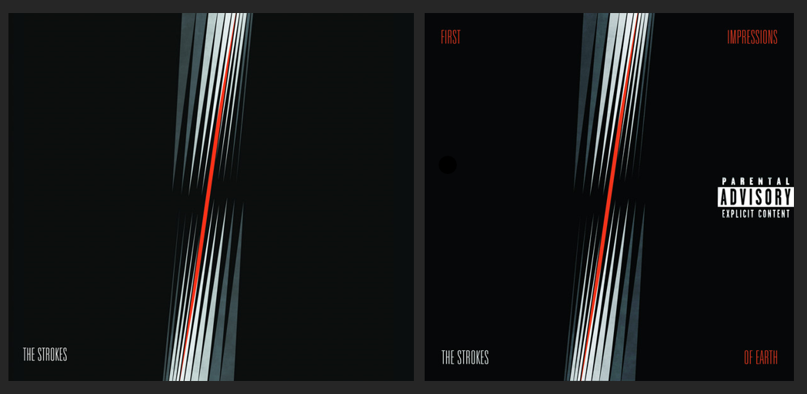

# abnoRmal
##### an analysis of The Strokes' discography using the `spotifyr` package and my Spotify listening history


___

```{r setup, message = F, warning = F, include = F}
library(tidyverse)
library(spotifyr)
library(DT)

# library(spotifyr)
# library(plyr)
# library(tidyverse)
# library(httr)
# library(rvest)
# library(stringr)
# library(ggthemes)
# library(tidytext)
# library(wordcloud)
# library(ggridges)
# library(wesanderson)
# library(yarrr)
# library(knitr)
# library(kableExtra)
# library(radarchart)

options(scipen = 999)
knitr::opts_chunk$set(message = F, warning = F)
theme_set(theme_minimal())
```

```{r API link, include = F}
# setting up my Spotify client ID & client secret
Sys.setenv(SPOTIFY_CLIENT_ID = "5d531eb87ca340cb8e8e1faad7bed4fa")
Sys.setenv(SPOTIFY_CLIENT_SECRET = "1f4c4a6c46524ed391414a94dbe5bc4b")
access_token = get_spotify_access_token()
```

```{r API link to publish, eval = F, include = T}
# setting up my Spotify client ID & client secret
Sys.setenv(SPOTIFY_CLIENT_ID = "client ID here")
Sys.setenv(SPOTIFY_CLIENT_SECRET = "client secret here")
access_token = get_spotify_access_token()
```

```{r}
# using spotifyr to get data on The Strokes
strokes = get_artist_audio_features("the strokes")

# confirming we have the correct albums
strokes |>
  count(album_name)
```

There are too many tracks for *Is This It* and *First Impressions Of Earth* - let's inspect that (although I wish they had 33 and 28 tracks)

```{r}
strokes |>
  filter(album_name == "First Impressions Of Earth") |>
  count(track_name) |>
  head(5)
```

looks like everything is double counted, there seems to just be one duplicate - let's inspect what's different by looking at the multiple entries for the album's first track, *You Only Live Once*

```{r}
strokes |>
  filter(track_name == "You Only Live Once") |>
  select(artist_name, album_release_date, track_name, album_name)
```

we have different values for the following variables:

- `danceability` (0.631 v. 0.630)
- `energy` (0.905 v. 0.908)
- `loudness` (-2.44 v. -2.42)
- `speechiness` (0.0325 v. 0.0326)
- `acousticness` (0.0328 v. 0.0238)
- `instrumentalness` (0.528 v. 0.592)
- `liveness` (0.125 v. 0.116)
- `valence` (0.969 v. 0.968)
- `tempo` (120.520 v. 120.522)

so how do we decide which one we keep and which we omit?

looking at [this forum](https://community.spotify.com/t5/iOS-iPhone-iPad/Duplicates-of-the-same-albums/td-p/4542505), it looks like i would probably want to default to the most recent release. however, as you can see below, the different versions of the album in the data have the same release date.

```{r}
strokes |>
  filter(album_name == "First Impressions Of Earth") |>
  count(album_release_date)
```

upon further inspection, i found my answer in the `album_images` column. i'll put the images side-by-side below and we can pretty easily see which one is the right album cover.



so now i'll make sure to omit all instances of the first version of the album using the `album_id` variable, which is unique for each of the two versions.

```{r}
strokes = strokes |>
  filter(album_id != "1HQ61my1h3VWp2EBWKlp0n")
```

and now we need to address the same issue for The Strokes' first album, *Is This It*.

```{r}
strokes |>
  filter(album_name == "Is This It") |>
  count(track_name) |>
  head(5)
```

here we have three different versions of the album. again, taking a look at the album images, i can tell which one is the version currently on spotify, so i will choose that one to keep.

```{r}
strokes = strokes |>
  filter(album_id != "1BbxngE1wn7Lzantkvket2" & album_id != "2yNaksHgeMQM9Quse463b5")

strokes |>
  count(album_name)
```

now the data is free of duplicates and we can resume with our analysis.

```{r}
strokes |>
  select(artist_name, album_name, track_name) |>
  head(9)
```

```{r}
# genius_get_artists <- function(artist_name = "the strokes", n_results = 10) {
#   baseURL <- 'https://api.genius.com/search?q='
#   requestURL <- paste0(baseURL, gsub(' ', '%20', artist_name),
#                        '&per_page=', n_results,
#                        '&access_token=', access_token)
#   
#   res <- GET(requestURL) %>% content %>% .$response %>% .$hits
#   
#   map_df(1:length(res), function(x) {
#     tmp <- res[[x]]$result$primary_artist
#     list(
#       artist_id = tmp$id,
#       artist_name = tmp$name
#     )
#   }) %>% unique
# }
# 
# genius_artists = genius_get_artists("the strokes")
```

```{r}
df = data.frame(lyrics = c("they been saying", "you sophisticated", "we can't help it"))

str = ""
for (i in 1:length(df$lyrics)) {
  str = paste(str, df$lyrics[i])
}

str
```


