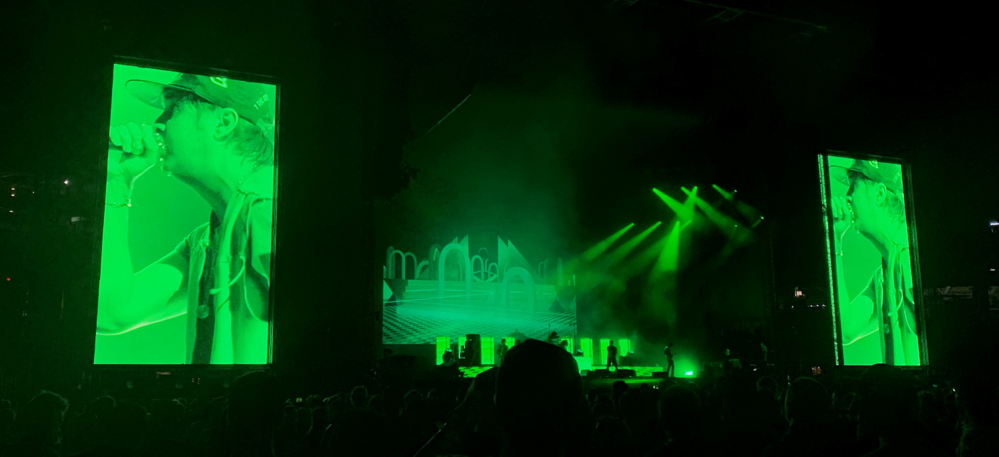

# abnoRmal
##### an analysis of The Strokes' discography using the `spotifyr` package



___

### setup

```{r setup, message = F, warning = F}
library(tidyverse)
library(spotifyr)
library(DT)
library(ggridges)
options(scipen = 999)
knitr::opts_chunk$set(message = F, warning = F)
theme_set(theme_minimal())
```

```{r API link, include = F}
# setting up my Spotify client ID & client secret
Sys.setenv(SPOTIFY_CLIENT_ID = "5d531eb87ca340cb8e8e1faad7bed4fa")
Sys.setenv(SPOTIFY_CLIENT_SECRET = "1f4c4a6c46524ed391414a94dbe5bc4b")
access_token = get_spotify_access_token()
```

### linking to Spotify API

```{r API link to publish, eval = F, include = T}
# setting up my Spotify client ID & client secret
Sys.setenv(SPOTIFY_CLIENT_ID = "client ID here")
Sys.setenv(SPOTIFY_CLIENT_SECRET = "client secret here")
access_token = get_spotify_access_token()
```

### getting artist information on The Strokes from `spotifyr`

```{r}
# using spotifyr to get data on The Strokes
strokes = get_artist_audio_features("the strokes")

# confirming we have the correct albums
strokes |>
  count(album_name)
```

there are too many tracks for "Is This It" and "First Impressions Of Earth" - let's inspect that (although I wish they had 33 and 28 tracks)

### finding where we have duplicate tracks

```{r}
strokes |>
  filter(album_name == "First Impressions Of Earth") |>
  count(track_name) |>
  head(5)
```

looks like everything is double counted, there seems to just be one duplicate - let's inspect what's different by looking at the multiple entries for the album's first track, "You Only Live Once"

### getting information for the track "You Only Live Once"

```{r}
strokes |>
  filter(track_name == "You Only Live Once") |>
  select(artist_name, album_release_date, track_name, album_name)
```

we have different values for the following variables:

- `danceability` (0.631 v. 0.630)
- `energy` (0.905 v. 0.908)
- `loudness` (-2.44 v. -2.42)
- `speechiness` (0.0325 v. 0.0326)
- `acousticness` (0.0328 v. 0.0238)
- `instrumentalness` (0.528 v. 0.592)
- `liveness` (0.125 v. 0.116)
- `valence` (0.969 v. 0.968)
- `tempo` (120.520 v. 120.522)

so how do we decide which one we keep and which we omit?

looking at [this forum](https://community.spotify.com/t5/iOS-iPhone-iPad/Duplicates-of-the-same-albums/td-p/4542505), it looks like i would probably want to default to the most recent release. however, as you can see below, the different versions of the album in the data have the same release date.

### checking album release dates

```{r}
strokes |>
  filter(album_name == "First Impressions Of Earth") |>
  count(album_release_date)
```

upon further inspection, i found my answer in the `album_images` column. i'll put the images side-by-side below and we can pretty easily see which one is the right album cover.


so now i'll make sure to omit all instances of the first version of the album using the `album_id` variable, which is unique for each of the two versions.

### omitting duplicate album

```{r}
strokes = strokes |>
  filter(album_id != "1HQ61my1h3VWp2EBWKlp0n")
```

and now we need to address the same issue for The Strokes' first album, "Is This It".

### checking for duplicates for the album "Is This It"

```{r}
strokes |>
  filter(album_name == "Is This It") |>
  count(track_name) |>
  head(5)
```

here we have three different versions of the album. again, taking a look at the album images, i can tell which one is the version currently on Spotify, so i will choose that one to keep.

### omitting duplicates for "Is This It"

```{r}
strokes = strokes |>
  filter(album_id != "1BbxngE1wn7Lzantkvket2" & album_id != "2yNaksHgeMQM9Quse463b5")

strokes |>
  count(album_name)
```

now the data is free of duplicates and we can resume with our analysis.

### overview of data

```{r}
strokes |>
  select(artist_name, album_name, track_name) |>
  glimpse()
```

### valence (measure of energy) by album

```{r}
album_levels = c("Is This It", "Room On Fire", "First Impressions Of Earth",
                 "Angles", "Comedown Machine", "The New Abnormal")

strokes$album_name = factor(strokes$album_name, levels = album_levels)

strokes |>
  ggplot(aes(valence, fct_rev(album_name))) +
  geom_density_ridges(aes(fill = album_name), scale = 0.9, col = "transparent", alpha = 0.75) +
  labs(x = "valence", y = NULL) +
  theme(legend.position = "none",
        axis.text.x = element_blank())
```

### function to scrape song lyrics

```{r}
get_song_lyrics = function(song) {
  df = get_lyrics_search(artist_name = "The Strokes",
                         song_title = song)
  str = ""
  for (i in 1:nrow(df)) {
    str = paste(str, df$line[i])
  }
  return(trimws(str))
}
```

the above function was able to scrape the lyrics for all but just a few tracks. for the remaining tracks, I just searched for its lyrics and added them manually.

### loading in data with all lyrics

```{r}
strokes = read_csv("strokes_all_lyrics.csv", col_types = cols())
```

### wordclouds for most common lyrics for different parts of speech

```{r}
library(tidytext)
library(wordcloud)
library(wesanderson)
library(dplyr)
library(yarrr)

word_count = strokes |>
  unnest_tokens(word, lyrics) |>
  count(word, sort = T) |>
  mutate(word = reorder(word, n)) |>
  ungroup()

generate_wordcloud = function(part) {
  valid_words = parts_of_speech |>
    filter(str_detect(pos, part)) |>
    pull(word)
  
  fdata = word_count |>
    filter(word %in% valid_words)
  
  wordcloud(words = fdata$word, freq = fdata$n,
            max.words = 100, random.order = F,
            colors = c("#ABCCD4", "#E9B3FF", "#82AC7E"))
}

generate_wordcloud("Noun")
generate_wordcloud("Adjective")
generate_wordcloud("Adverb")
generate_wordcloud("Verb")
```

### pirate plot of track "sonic score" by album

```{r}
pirateplot(valence + danceability + energy ~ album_release_year, strokes,
           pal = c("#FFF58F", "#C10000", "#000000", "#FF7DEF", "#FF5F5A", "#5AA0FF"),
           xlab = "album", ylab = "sonic score", main = "sonic score = valence + danceability + energy",
           theme = 0, point.o = 0.7, avg.line.o = 1, jitter.val = .05, 
           bty = "n", cex.axis = 0.6, xaxt = "n")

axis(1, cex.axis = 0.6, lwd = 0)
legend("topright", c("1: Is This It", "2: Room on Fire", "3: First Impressions of Earth",
                     "4: Angles", "5: Comedown Machine", "6: The New Abnormal"), bty = "n", cex = 0.6)
```

### getting sonic scores for all tracks

```{r}
sonic_tracks = function(album) {
  return(strokes |>
           mutate(sonic_score = valence + danceability + energy) |>
           select(album_name, track_name, sonic_score) |>
           arrange(desc(sonic_score)) |>
           filter(album_name == album))
}

all_albums = c("Is This It", "Room On Fire", "First Impressions Of Earth",
               "Angles", "Comedown Machine", "The New Abnormal")

lapply(all_albums, sonic_tracks)
```

### lexical diversity: ratio of unique words to total number of words in a track

```{r}
words_by_album = strokes |>
  select(album_name, track_name, lyrics) |>
  unnest_tokens(words, lyrics) |>
  group_by(album_name, track_name) |>
  summarise(n = n(),
            .groups = "drop")

unique_words_album = strokes |>
  select(album_name, track_name, lyrics) |>
  unnest_tokens(words, lyrics) |>
  group_by(album_name, track_name) |>
  distinct(words) |>
  group_by(album_name, track_name) |>
  summarise(n = n(),
            .groups = "drop")

track_lex_diversity = words_by_album |>
  left_join(unique_words_album, by = c("album_name", "track_name")) |>
  rename(words = n.x, unique_words = n.y) |>
  mutate(lexical_diversity = round(unique_words / words, 3)) |>
  arrange(desc(lexical_diversity)) |>
  select(album_name, track_name, lexical_diversity)

ld_limit = 10

bind_rows(head(arrange(track_lex_diversity, desc(lexical_diversity)), ld_limit),
          tail(arrange(track_lex_diversity, desc(lexical_diversity)), ld_limit)) |>
  arrange(desc(lexical_diversity)) |>
  mutate(album_name = factor(album_name, levels = album_levels)) |>
  ggplot(aes(reorder(track_name, lexical_diversity), lexical_diversity)) +
  geom_col(aes(fill = album_name), width = 0.5, alpha = 0.75) +
  geom_text(aes(label = lexical_diversity), hjust = -0.5, size = 3) +
  geom_vline(xintercept = 10.5, linetype = "dotted") +
  coord_flip(ylim = c(0, 0.75)) +
  labs(x = "song title", y = "lexical diversity", fill = NULL,
       title = "ten most and least lexically diverse Strokes tracks") +
  theme(plot.title = element_text(hjust = 0.5))
```

### using AFINN lexicon to get sentiment scores

```{r}
# getting word values from AFINN
afinn = strokes |>
  unnest_tokens(word, lyrics) |>
  inner_join(get_sentiments("afinn")) |>
  select(track_name, album_name, word, value)

sample_n(afinn, 10)
```

### which albums are the most positive or negative as a whole?

```{r}
afinn |>
  group_by(album_name) |>
  summarise(value = sum(value)) |>
  mutate(album_name = factor(album_name, rev(album_levels))) |>
  ggplot(aes(album_name, value)) +
  geom_col(aes(fill = album_name)) +
  coord_flip() +
  labs(x = NULL, y = "negativity / positivity",
       title = "total lyrical sentiment by album") +
  theme(legend.position = "none",
        plot.title = element_text(hjust = 0.5))
```

### total positivity and negativity in each album

```{r}
afinn |>
  mutate(pos_neg = ifelse(value > 0, "pos", "neg")) |>
  group_by(album_name, pos_neg) |>
  summarise(score = sum(value),
            .groups = "drop") |>
  mutate(album = paste0(album_name, "_", pos_neg),
         album_name = factor(album_name, levels = rev(album_levels)),
         pos_label = ifelse(score > 0, score, ""),
         neg_label = ifelse(score < 0, score, "")) |>
  ggplot(aes(album_name, score)) +
  geom_col(aes(fill = album)) +
  geom_text(aes(label = pos_label), size = 3, hjust = 1.5) +
  geom_text(aes(label = neg_label), size = 3, hjust = -0.5) +
  scale_fill_manual(values = c("#688BC4", "#C8D7F0", "#B071CE", "#E2C4F0", "#73B15B", "#AED59F",
                               "#D26969", "#F2B9B9", "#E5A83E", "#EED09D", "#D374C1", "#F7D7F1")) +
  coord_flip() +
  labs(x = NULL, y = "negativity / positivity",
       title = "positive and negative lyrical sentiment by album") +
  theme(legend.position = "none",
        plot.title = element_text(hjust = 0.5),
        axis.text.x = element_blank())
```

### getting sentiments from NRC lexicon

```{r}
strokes_nrc = strokes |>
  unnest_tokens(word, lyrics) |>
  inner_join(get_sentiments("nrc"), by = "word") |>
  select(track_name, album_name, word, sentiment) |>
  filter(!sentiment %in% c("positive", "negative")) |>
  mutate(album_name = factor(album_name, levels = album_levels))

album_sent = strokes_nrc |>
  count(album_name, sentiment) |>
  rename(sent_count = n)

sample_n(album_sent, 10)
```

### sentiment percents by album

```{r}
album_counts = strokes_nrc |>
  count(album_name) |>
  rename(album_total = n)

radar_df = album_sent |>
  inner_join(album_counts, by = "album_name") |>
  mutate(percent = round((sent_count / album_total * 100), 3)) |>
  select(-c(sent_count, album_total)) |>
  pivot_wider(sentiment, names_from = "album_name", values_from = "percent")

radar_df |>
  pivot_longer(!sentiment, names_to = "album", values_to = "percent") |>
  mutate(album = factor(album, levels = album_levels),
         sentiment = fct_rev(sentiment)) |>
  ggplot(aes(sentiment, percent)) +
  geom_col(aes(fill = album), position = "dodge", alpha = 0.75) +
  geom_vline(xintercept = 1.5, linetype = "dashed") +
  geom_vline(xintercept = 2.5, linetype = "dashed") +
  geom_vline(xintercept = 3.5, linetype = "dashed") +
  geom_vline(xintercept = 4.5, linetype = "dashed") +
  geom_vline(xintercept = 5.5, linetype = "dashed") +
  geom_vline(xintercept = 6.5, linetype = "dashed") +
  geom_vline(xintercept = 7.5, linetype = "dashed") +
  coord_flip() +
  labs(x = "sentiment", y = "percent", fill = NULL,
       title = "sentiment percentages by album") +
  theme(plot.title = element_text(hjust = 0.5))
```


